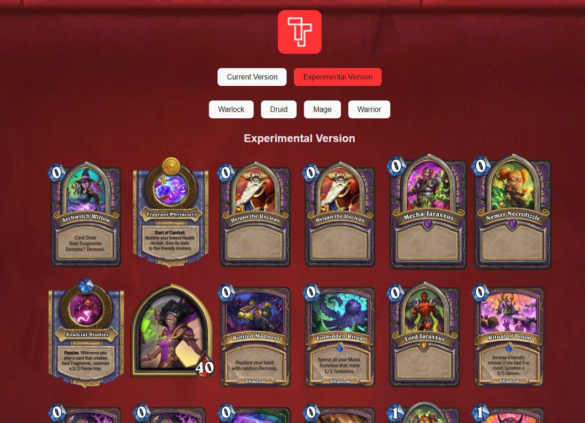

## Reactjs Use Hook Example
 
[pt-BR]
Este projeto contém dois exemplos para uma requisição assíncrona simples em um projeto React.

O primeiro exemplo é o `Current Version` no qual demonstro uma requisição assíncrona com os hooks `useState` e `useEffect`.

O segundo exemploe é o `Experimental Version` no qual demonstro a mesma chamada porém utilizando o Hook `use` que está em fase [experimental](https://github.com/reactjs/rfcs/pull/229).

Para as requisições utilizo uma [api pública](https://rapidapi.com/omgvamp/api/hearthstone) para retornar alguns cards do jogo Hearthstone.
 
 
 
[en-US]
This project contains two examples to realize a assync call in a simple React project.

The first examploe is the `Current Version` in which I demonstrate a assync request with `useState` and `useEffect` hooks.

The second one example is the `Experimental Version` in which I demonstrate the same assync call however using the experimental hook `use` of which it is in an [experimental phase](https://github.com/reactjs/rfcs/pull/229).

To the requests I use the [public api](https://rapidapi.com/omgvamp/api/hearthstone) to return some cards 
___

Resultado final / Final result:

